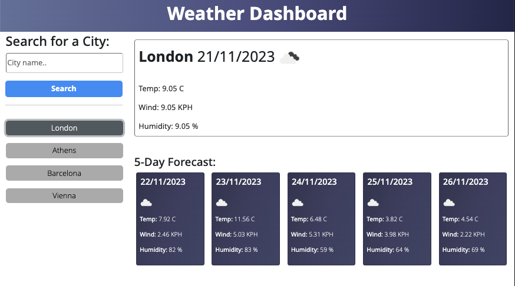

# Weather Dashboard

This repository contains a front-end web application that serves as a weather dashboard. Users can search for a city, and the application provides the current temperature, humidity, wind speed, as well as a 5-day weather forecast. The project utilizes APIs, asynchronous functions, and dynamically updates the UI to display real-time weather information.

## Usage
To explore the Weather Dashboard and check real-time weather information for your desired city, you need a free API key from https://openweathermap.org/.  

Once you gain access to an API key, you can: 

- Clone this repository and update the API key on script.js.

- Access the deployed application [here](https://jimmygian.github.io/weather-dashboard/) and paste the API key when prompted.

## Motivations

1. **API Integration:** The primary goal of this project was to gain hands-on experience with API integration, particularly with the OpenWeatherMap API. The application fetches weather data based on user input, demonstrating proficiency in making API requests and handling responses.

2. **Asynchronous JavaScript:** Asynchronous functions and the `fetch()` API are central to this project. The goal was to understand how to manage asynchronous operations effectively, ensuring a smooth user experience while waiting for API data.

3. **User Interface:** The project emphasizes creating a clean and user-friendly interface. It uses Bootstrap for styling and responsiveness, providing a visually appealing and accessible weather dashboard.

## What Was Done

1. **Search Functionality:** The application features a search form allowing users to input the name of a city. Upon submission, the application fetches weather data for the specified city and updates the UI with the current weather and 5-day forecast.

2. **History Tracking:** The project includes a history section that displays the user's recent searches. This feature enhances user experience by allowing quick access to weather information for previously searched cities.

3. **Dynamic Forecast Cards:** The 5-day forecast section dynamically generates forecast cards based on the retrieved data. Each card displays relevant information, including date, weather icon, average temperature, wind speed, and humidity.

## Problems Addressed

1. **Error Handling:** The application addresses potential errors by incorporating error handling mechanisms. If a user enters an invalid city name or encounters any issues with the API request, appropriate error handling is provided.

2. **Dynamic UI Updates:** The project demonstrates the seamless updating of the UI based on asynchronous API responses. It ensures a responsive and engaging user interface that reflects real-time weather conditions.

3. **Local Storage:** The application uses local storage to store the user's recent searches. This feature enables users to quickly revisit cities they have previously searched for without re-entering the information.

## Insights Gained

Through the development of the Weather Dashboard, several key insights and skills were acquired:

- **API Interaction:** The project deepened understanding and proficiency in making API requests, handling responses, and extracting relevant data for display.

- **Asynchronous JavaScript:** The project honed skills in working with asynchronous functions and the `fetch()` API, ensuring smooth interactions and preventing blocking of the main thread.

- **User Interface Design:** By using Bootstrap and custom styling, the project enhanced knowledge of creating visually appealing and responsive user interfaces for web applications.

- **Error Handling:** Dealing with potential errors, such as invalid user input or failed API requests, was addressed to provide a more robust user experience.

## Credits

This project was developed by Dimitris. The GitHub repository is available at [Weather Dashboard Repository](https://github.com/jimmygian/weather-dashboard/).

## License

This project is licensed under the MIT License, allowing you the freedom to use and modify the code for your own projects. Customize it to suit your needs and contribute to its improvement.

## Links

- Deployed Application: [Weather Dashboard](https://jimmygian.github.io/weather-dashboard/)
- GitHub Repository: [Weather Dashboard Repository](https://github.com/jimmygian/weather-dashboard/)

